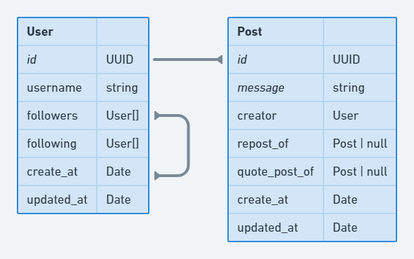

# Posterr Server

## Development Setup

> **Installing Packages**

- After cloning or downloading the project, go to the root of the project and install dependencies with `yarn` or `npm`

```bash
$ yarn        # npm install
```

> **ESLint and Prettier**

This configuration is intended to be used with VSCode, other IDEs were not tested.

- Make sure to have the **[ESLint](https://marketplace.visualstudio.com/items?itemName=dbaeumer.vscode-eslint)** extension installed and **not have** the **[Prettier - Code formatter](https://marketplace.visualstudio.com/items?itemName=esbenp.prettier-vscode)** installed, since the Prettier extensions might cause conflicts.
- Make sure to not have the `"editor.formatOnSave": true` configuration in your `settings.json` file.
- Make sure to restart VSCode after changing any of the above configurations.

> **Database**

- With docker installed, run `$ docker-compose up` on the root of the project and a postgres database should be created.
- The database can also be created without docker directly on the local machine as well, if prefarable.
- Make sure to have the file `ormconfig.json` proper configured with the connection variables.
- After creating the database (via docker or other method), a migration run is required so all the tables are created. The command `$ yarn typeorm migration:run` (or `$ npm run typeorm migration:run`) will create all the necessary database schema.

Here's the database Diagram for reference:


> **Dev Script**

- With the database already set up and running, run the `dev` script and the application should start.

```bash
$ yarn dev        # npm run dev
```


> **Tests**

The application has two types of tests: *Unit* and *Integration*.

- The *Unit* tests can be run without any extra effort since they run with a in-memory database. The idea of these tests are just to check the core business rules of the *useCases*.
- The *Integration* tests are more sophisticated tests that tests not only the *useCases* but also the endpoints, and they require a *tests* database in order to successfully run. The **name** of the test database can be found under the *index.ts* file, by default it's **posterr_testdb**. This database can be created manually with some GUI, by an SQL command like (`CREATE DATABASE posterr_testdb;`), or via docker.

Tests are specified under all `useCases` folders and have a prefix of `.spec.ts`.

To run all tests and generate a coverage page, just run:

```bash
$ yarn test        # npm run test
```

And wait until all tests are finished. A new folder will be generated under the root of the project called `coverage`. A HTML page is generated with the percentage of coverage of the useCases and can be accessed on `coverage/lcov-report/index.html`.

> **API Endpoints**

```http
# User Endpoints

// Create new User
POST /repositories 
Content-Type: application/json

{
  "username": "Cat"
}

// Get User
GET /user/cat 

// Follow User (User who is performing the action is the one in the header)
POST /user/follow/dog 
Header: { username: cat }

// Unfollow User (User who is performing the action is the one in the header)
POST /user/unfollow/dog 
Header: { username: cat }

# Post Endpoints

// Create new Post (User who is performing the action is the one in the header)
POST /post 
Content-Type: application/json
Header: { username: cat }

{
  "message": "Meow!"
}

// Repost (User who is performing the action is the one in the header)
POST /post/:postId/repost 
Header: { username: cat }

// Quote Post (User who is performing the action is the one in the header)
POST /post/:postId/quotePost
Header: { username: cat }

// List all Posts
GET /post

// List all Posts from Following (User who is performing the action is the one in the header)
GET /post/following
Header: { username: cat }

// List all Posts from yourself (User who is performing the action is the one in the header)
GET /post/self
Header: { username: cat }
```

## Use Cases

These are the Use Cases used to develop the application

- it should be able to get all posts from everyone (normal posts, reposts and quote posts)
- it should be able to get all posts by those who they follow (normal posts, reposts and quote posts)
- it should be able to create a new post
- it should be able to repost a post
- it should be able to quote post a post
- (EXTRA) it should be able to create a user
- it should be able to get user data
- it should be able to follow a user
- it should not be able to follow a user if they are already followed
- it should be able to unfollow a user
- it should not be able to unfollow a user if they already not follow
- it should not be able to follow themself
- it should be able to get all posts by themself (normal posts, reposts and quote posts)
- it should be able to check if they follow the user or not
- it should not be able to post a message greater than 777 characters
- it should not be able to post a empty message
- (MISSING) it should not be able to post more than 5 posts per day (including reposts and quote posts)

## Phase 2: Planning

My questions to the Product Manager about the `reply-to-post` functionality:

- Would the user be able to see all the replied posts in the original one? Like comments in Facebook posts, for example
- The reply will also be a post?
- Would be possible to reply to a reply?
- Should we notify the creator of the main post that someone replied to their post?
- Should we take reply in consideration to show recommended posts to user?
- Should the secondary feed loads in real-time to show new replied?

Considering a first basic scenario where the backend will only implement the reply post logic and return to the frontend on an endpoint as a first phase of implementation, these would be my next steps:

- Considering the implemented database schema, I'd probably create a `ReplyPost` entity similar to the others
- Relate that new entity to the User, to make sure we store who created that reply
- I'd create new endpoints similar to '/repost' and '/quotePost' so the frontend can call and we effectively create the record
- And Adjust the list all post methods and user data to make sure we're returning the Replies as well

## Phase 3: Critique

- First I'd like to have it done in a faster time. Due to wanting to apply as most knowledge as I could I ended spending more than 8 hours to develop the application
- Finishing the tests under `post` module would also be a next step for this project, aiming to have 100% test coverage
- I wish I could added a validation on a controller level as well, to avoid getting wrong inputs in the controller layer and not only on the service
- Also, double check the `cascade` delete options on the relations of the database to make sure everything is correct
- Since the project will probably have a lot of requests, I'd also do a performance test on each endpoint and check what could be improved in the database queries
- I didn't like 100% how to manage Posts, Reposts and QuotePosts (specially in to grab them), I feel these tables have a lot of similarities that maybe they could even be in just one table to increase performance (I tried that first approach but ended up taking too much time). If I had more time to investigate I'd definitely check how we can improve that
- Adding the Request Endpoints to on README is not ideal as well, with more time I'd add some library such as `Swagger` to better document the API
- Would also take a look to integrate Sentry to monitor the application and rate limiter to avoid too many requests to the server
- I'd also double check the API responses to make sure they all makes sense to the frontend, or if any information is missing
- Finally, if the application started to grow and the database became a pain point, I'd also consider changing it (or some parts) to a faster one